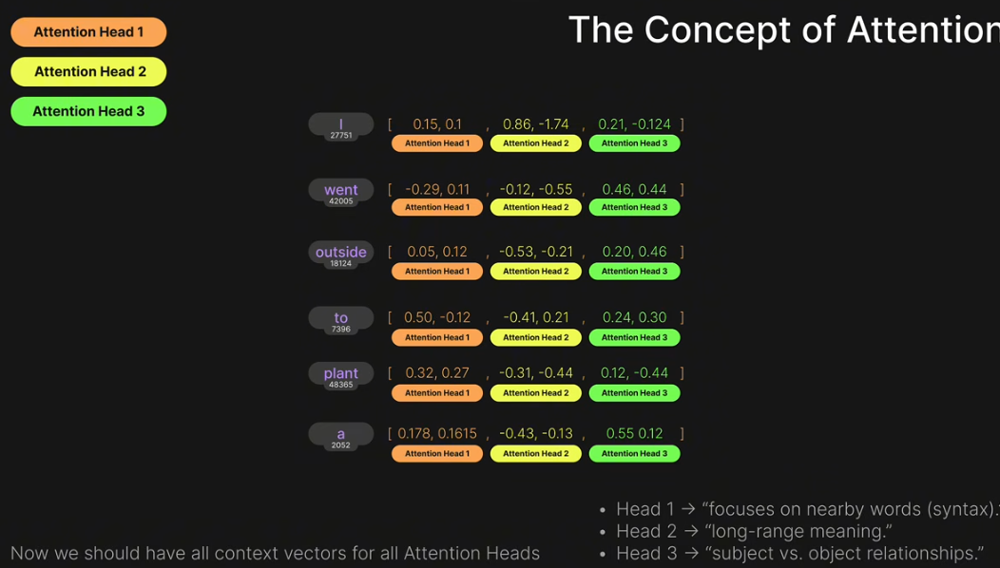
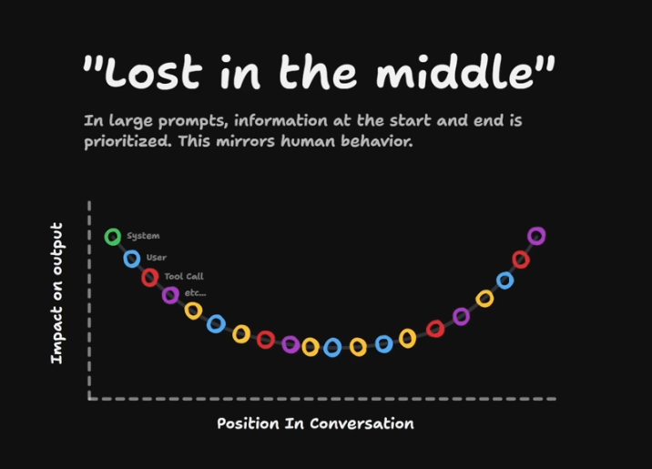

assigns a probability to the next word

they have billions of parameters and are trained on huge datasets
these parameters begin at random
and are adjusted during training to minimize the difference between the predicted next word and the actual next word in the training data

backpropagation is the process by which the model learns from its mistakes and updates its parameters accordingly

this is just pre training

reinforcement learning is used to further fine tune the model for specific tasks, such as following instructions or generating more coherent responses

the model can only be trained to many operations running in parallel on powerful hardware, such as GPUs or TPUs

transformers are a type of neural network architecture that has been particularly successful in natural language processing tasks, such as language modeling and machine translation
how they work is by using self attention mechanisms to weigh the importance of different words in a sentence when making predictions about the next word

for example in the sentence "the cat sat on the mat", the model might learn that the word "cat" is more important than the word "the" when predicting the next word after "sat".

the model learns to capture the relationships between words in a sentence, which allows it to generate more coherent and contextually appropriate responses

feedforward neural networks are a type of neural network architecture that is commonly used in language models. They consist of multiple layers of interconnected nodes, where each node takes in input from the previous layer and produces an output that is passed on to the next layer. The output of the final layer is used to make predictions about the next word in a sentence.

GenAI
Generative AI (GenAI) refers to a class of artificial intelligence models that are designed to generate new content, such as text, images, or music, based on patterns learned from existing data. These models can create original and creative outputs that mimic human-like behavior.

Foundational models are large-scale pre-trained models that serve as a base for various downstream tasks. They are trained on vast amounts of data and can be fine-tuned for specific applications, such as language translation, sentiment analysis, or question-answering.

Fine tuning is the process of taking a pre-trained foundational model and adapting it to a specific task or domain by training it on a smaller, task-specific dataset. This allows the model to learn the nuances and specificities of the target task while leveraging the general knowledge acquired during pre-training.

Diffusion models are a type of generative model that learn to generate data by modeling the process of diffusion, which is the gradual transformation of one distribution into another. These models can be used for tasks such as image generation, where they learn to create new images by simulating the diffusion process.

stable diffusion is a specific type of diffusion model that has been shown to be effective in generating high-quality images. It works by iteratively refining a noisy image until it converges to a clear and coherent output. This process allows the model to generate detailed and realistic images based on the patterns it has learned from the training data.

I went outside to plant a..

tokenize this 

token : id 
I -> 27751
went -> 42005
out -> 18124
side -> 3889
to -> ...

Embedding 

token ID Embedding vector 
I : 27751 : [0.1, 0.2, 0.3, ...]
went : 42005 : [0.4, 0.5, 0.6, ...]
out : 18124 : [0.7, 0.8, 0.9, ...]
side : 3889 : [0.2, 0.3, 0.4, ...]
to : ... : ...

what you see on the right is embedding matrix - token embeddings + positional encodings

Positional encoding is a technique used in transformer models to provide information about the position of each token in the input sequence. Since transformers do not have a built-in notion of word order, positional encodings are added to the token embeddings to help the model understand the relative positions of words in a sentence. This allows the model to capture the sequential nature of language and make more accurate predictions about the next word in a sentence.

We end up with a matrix of token embeddings and positional encodings that is fed into the transformer model for processing. The model then uses self-attention mechanisms to weigh the importance of different tokens in the input sequence and generate predictions about the next word based on the learned relationships between tokens.

Self - attention

the query, key, and value vectors are computed from the input embeddings using learned weight matrices. The attention scores are calculated by taking the dot product of the query vector with the key vectors, which gives a measure of how much attention should be paid to each token in the input sequence. The attention scores are then normalized using a softmax function to obtain attention weights, which are used to compute a weighted sum of the value vectors. This weighted sum is the output of the attention mechanism, which captures the relevant information from the input sequence based on the learned relationships between tokens.

Logits are raw normalized scores that represent the model's predictions for the next word in a sentence. They are computed by applying a linear transformation to the output of the transformer model, which maps the high-dimensional output to a vector of logits corresponding to each possible next word in the vocabulary. The logits are then passed through a softmax function to convert them into probabilities, which represent the model's confidence in each possible next word. The word with the highest probability is typically selected as the model's prediction for the next word in the sentence.

pick next token
tokens could be randomly sampled in proportion to their probabilities, or the token with the highest probability could be selected (greedy decoding). The choice of decoding strategy can affect the diversity and coherence of the generated text.

loop until the entire text generation is complete

There are special end of sequence characters / token limit that indicate when the model should stop generating text.

Detokenization
Takes ids and maps them to human readable text.

Context window Limit

